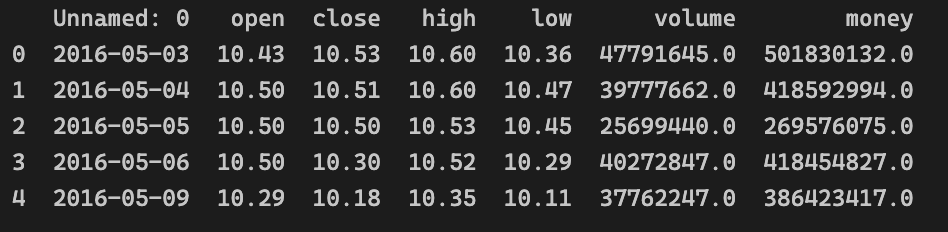

## 金融大数据与量化分析  CAPM检验

崔轩宁 1800013083


### 步骤一：数据获取

> 代码见data_retrive.ipynb

通过聚宽平台jqdatasdk包进行数据获取，所有数据均来自于聚宽平台。

浦发银行：600000.XSHG，选取的大盘股

浙江龙盛：600352.XSHG，选取的小盘股

上证综指：000001.XSHG，用此代表基准收益

国债指数：000012.XSHG，用此代表无风险收益

将所有文件数据以csv格式保存在data目录下，包括如下信息：

```
date, open, close, high, low, volume, money
```

以浦发银行为例进行展示：




### 步骤二：画出收益率图

> 代码见yield_draw.ipynb

#### 数据处理

所下载数据以日为单位，但最终统计以月为单位，故先计算每月收益率。具体来说，我们将2016年5月1日的开盘价近似为2016年4月的收盘价，此后根据每月最后一天的收盘价计算当月收益率，再进一步计算累计收益率

#### 画图

用seaborn进行作图，需要先设置如下指令以使得其可以显示中文及负号，当然前提是对应库中有SimHei字体

```python
sns.set(font="simhei")
plt.rcParams["axes.unicode_minus"] = False
```

利用所求数据进行作图，结果如下：

**不同证券的月度收益率**


**不同证券的累计收益率**


### 步骤三：评价指标计算

> 代码见compute_metrics.ipynb

#### 数据处理

以第一日收盘价为基准计算新的净值序列

#### 指标计算

##### 持有收益

只需根据最后一日的收盘价和起初的收盘价即可得

##### 年化收益率

假定一年天数为days_per_year，其默认值为245，根据简单公式容易计算出

##### 最大回撤

两层循环找到最大回撤，当然也可以预处理后单层循环搞定

##### 夏普比率

策略年化收益已经得出，无风险利率用国债指数来代替，策略年化收益波动率用日化收益波动率乘上每年天数的开方得到

根据公式即可计算


### 步骤四：相关性计算

> 代码见compute_parameters.ipynb

所需所有指标均可以通过库函数计算得出，结果列举如下


### 步骤五：CAPM模型

> 代码见CAPM.ipynb

#### 数据处理

以国债指数作为无风险收益，计算其他三只股的超额收益

#### 画图

拟合采用sklearn的LinearRegreesion方法，画图采用matplotlib的pyplot方法，结果如下

**浦发银行的CAPM估计**


**浙江龙盛的CAPM估计**


### 步骤六：分解alpha和beta

> 代码见model.ipynb

采用statsmodels的OLS方法进行模型拟合，打印模型信息如下

**浦发银行的拟合模型OLS**


**浙江龙盛的拟合模型OLS**


表格总结如下

| 股票     | alpha      | t-value | 含义     | beta   | t-value | 含义         |
| -------- | ---------- | ------- | -------- | ------ | ------- | ------------ |
| 浦发银行 | -3.277e-05 | -0.546  | 超额收益 | 0.7215 | 4.874   | 与市场相关性 |
| 浙江龙盛 | 9.761e-05  | 0.785   | 超额收益 | 1.3539 | 4.421   | 与市场相关性 |

结论

- 浦发银行的超额收益为负，说明该股票相对于上证指数的超额收益能力相对较弱；浙江龙盛的超额收益为正，说明该股票相对于上证指数的超额收益能力相对较强；但两者均接近于0，说明两股收益中与大盘波动无关的比例很小，几乎全部受大盘影响
- 浙江龙盛的beta值相较于浦发银行的beta值更大，意味着前者与市场具有更强的相关性，更容易受大盘波动影响
- beta的t-value值普遍大于alpha的t-value值，说明前者相较于后者更为显著


### 步骤七：风险分析

> 代码见model.ipynb

各数据都已经获取得到，统计表格如下

| 股票     | 总风险 | 系统性风险 | 公司风险 |
| -------- | ------ | ---------- | -------- |
| 浦发银行 | 0.0543 | 0.0392     | 0.1512   |
| 浙江龙盛 | 0.1094 | 0.1481     | 0.0387   |
